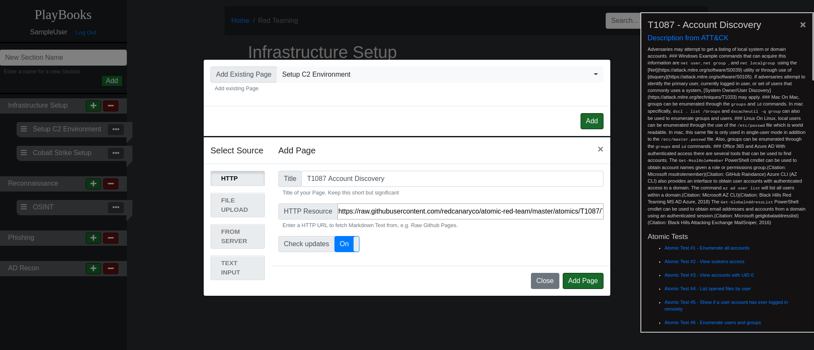
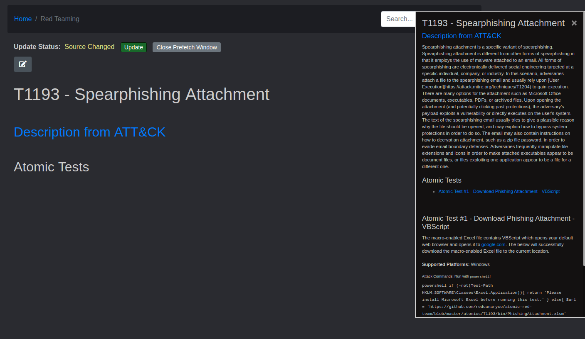

# PlayBooks

PlayBooks is a project i've build to ease the creation of knowledge playbooks for different scenarios. 
Create your own **Markdown** playbooks for whatever scenario you usually encounter, from development tasks to a full RedTeam rundown. 

PlayBooks not only provides an easily self hosted platform to create playbooks, but builds on the idea of collaborative knowledge sharing and sourcing internal and external resources into your playbooks. You can write your own pages from scratch or add existing pages from the web, through file uploads or from system directories enabled for access. 
**The kicker is:** If you include an existing page, e.g. from the amazing [Atmoic Red Team GitHub Repo](https://github.com/redcanaryco/atomic-red-team) you will be informed if the linked source has been updated and can pull the latest updates directly from the original source.

## Features

- Create playbooks from scratch
- Write Markdown, read HTML
- Copy+Paste Images into your PlayBook pages
- Add-In Existing Markdown pages from external sources via HTTP or from internal sources via File Upload Or enable system folders for access
- Notification when a linked source page has been updated, directly pull updates from the original source 
- Full Text Search through all your created Pages
- Easy setup and self hosting, everyhting is and stays local (PlayBooks does not send out any data)

**Example Use Case:** You got an internal repo as knowledge base? 
> Setup PlayBooks on a slim Webserver, add automated task to pull your knowledge base nightly, enable PlayBooks for read access to the local, cloned knowledge base, add articles from that knowledge to your playbooks, get informed and pull updates from the upstream repo whenever. 

Examples and Screenshots can be found in [the Wiki](https://github.com/csandker/Playbooks/wiki)

## Installation & Setup

Please see [the Wiki](https://github.com/csandker/Playbooks/wiki/1.-Installation-&-Setup) for instruction how to setup Playbooks and get started.

## Preview

**Overview of the dashboard:** 

**Uploading Markdown articles, e.g. using the HTTP Uploader:** 

**Be notified when an MD article has been updated:** 

## Disclaimer

Currently this project is published in debug mode to ease development. 
See [Wiki](https://github.com/csandker/Playbooks/wiki/4.-Production-Use) for Production use.
